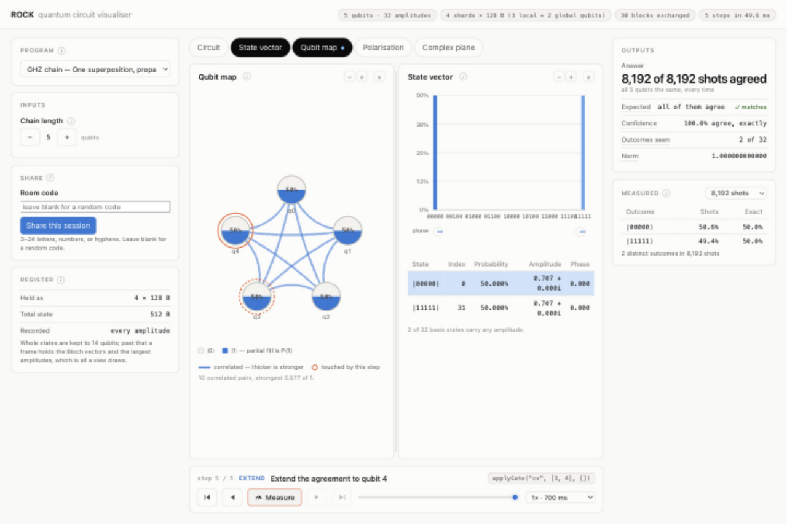
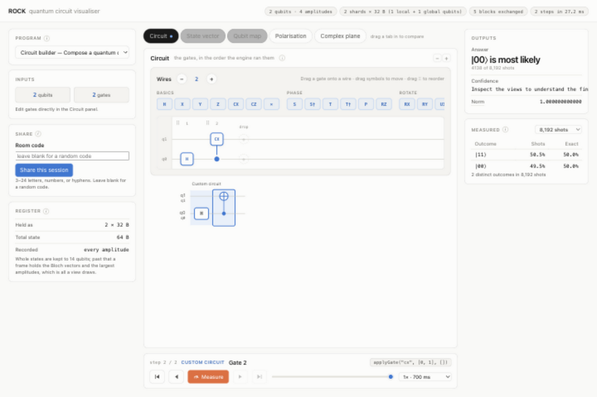

# ROCK

Build quantum circuits, step through their execution, and share the simulation across browsers. ROCK runs a Rust state-vector simulator in WebAssembly, with a React interface for exploring gates, entanglement and measurement.

Built by **Quantum Bitches**, the team of **William Jackson, Julio and Johnny**, for the **2026 QUT Code Network Hackathon**.



## What it does

- Compose circuits with a drag-and-drop gate editor, or explore ten built-in examples, including teleportation, Grover search and QAOA.
- Step through gates and compare the circuit, state vector, qubit map, Bloch spheres and complex amplitudes side by side.
- Sample measurement outcomes and compare them with the exact probabilities.
- Share a session over WebRTC. Other browsers follow your view, contribute measurement shots, or pool memory for a distributed register.

## Demo

The five-qubit GHZ example starts at `|00000⟩`, creates a superposition, then links the qubits with controlled-X gates. Measurement produces either `|00000⟩` or `|11111⟩`.


[Watch or download the MP4](docs/media/ghz-demo.mp4).

To try it locally, select **GHZ chain**, open **Qubit map**, then **Shift-click State vector** to compare both views. Press **Play**, then **Measure** when the circuit finishes.

<details>
<summary>Circuit builder screenshot</summary>



Drag gates onto wires, move their targets, and reorder columns. The simulator updates as you edit.

</details>

## Run locally

You need Node.js with npm, Rust with Cargo, and `wasm-pack`. The setup below was verified with Node **26.8.2**, Rust **1.98.0** and wasm-pack **0.15.0**.

```sh
git clone https://github.com/williamjaackson/distributed-quantum-computing.git
cd distributed-quantum-computing

# Build the local WASM dependency before installing the web app.
npm run build:wasm
npm --prefix web ci
npm --prefix net/signaling-server ci
npm run dev
```

Open the local URL printed by Vite, normally `http://localhost:5173`.

```sh
npm test          # Rust, WASM smoke tests, typecheck, programs and networking
npm run build     # Build the WASM engine and production frontend
npm run preview   # Preview the build with the signaling relay
```

## Shared sessions

Select **Share this session** and send the generated link to another browser. For another device on your LAN, open the app using Vite's **Network** URL before sharing; a `localhost` link only works on the same machine.

Viewers follow the host's circuit and layout. Measurement work can be split between peers; **Expand** distributes one register across their worker-owned WASM shards. The development and preview servers include the signaling relay at `/ws`.

This is a hackathon prototype running a classical simulation. Memory doubles with every added qubit. Shared sessions use STUN without a TURN fallback, so some networks cannot connect. Anyone with the room code can join, and losing a machine in Expand mode aborts the distributed run.

## Inside the project

| Directory | Purpose |
| --- | --- |
| [engine/](engine/README.md) | Rust gate kernels, measurement, sharding and WASM bindings |
| [web/](web/README.md) | React visualiser, example programs and browser workers |
| [net/signaling-server/](net/signaling-server/README.md) | WebSocket relay for WebRTC session setup |
