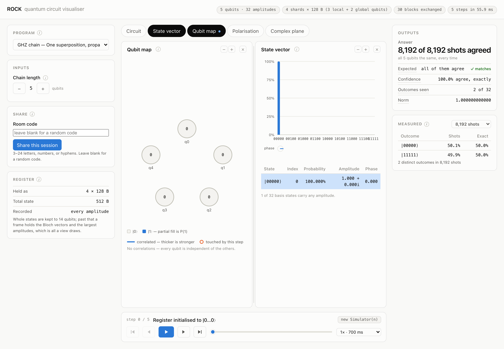

# ROCK

Distributed quantum simulation across a network of browsers. Each peer runs part of a Rust/WebAssembly state-vector simulator; WebRTC packets exchange amplitude data so gates and simulated entanglement work across machines. Peers can also split measurement workloads.

Build a circuit, step through it, and watch the shared quantum state change.



Built by **Quantum Bitches** for the **2026 QUT Code Network Hackathon**.

| Team | Contribution |
| --- | --- |
| William · [@williamjaackson](https://github.com/williamjaackson) | Engine and UI |
| Johnny · [@mrDKkoala](https://github.com/mrDKkoala) | Distributed networking |
| Julio · [@sundayScoop](https://github.com/sundayScoop) | Real-world demo |

## Run locally

Requires Node.js, Rust and `wasm-pack`.

```sh
git clone https://github.com/williamjaackson/distributed-quantum-computing.git
cd distributed-quantum-computing
npm run build:wasm
npm --prefix web ci
npm --prefix net/signaling-server ci
npm run dev
```

Open Vite's URL, then **Share this session** to connect another browser. Use the Network URL for other devices and select **Expand** to distribute the state vector.

[Engine](engine/README.md) · [Visualiser](web/README.md) · [Networking](net/signaling-server/README.md)
